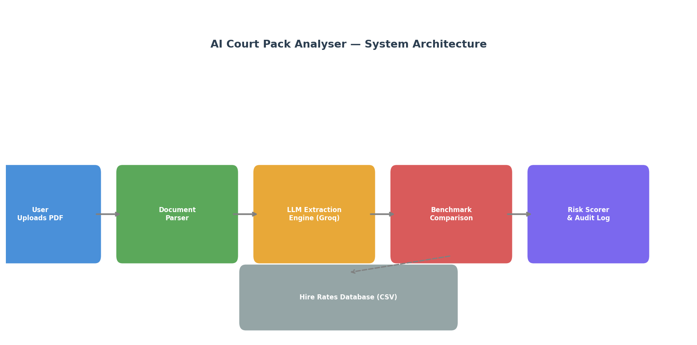

# AI Court Pack Analyser

## Problem
Motor insurance court packs are manually reviewed to validate credit hire rate claims — a slow, inconsistent, and costly process.

## Solution
This MVP automates the extraction, benchmarking, and risk scoring of court pack documents with fully auditable outputs.

## Outcome
Reduces manual review time, standardises rate comparison logic, and flags inflated claims with evidence-backed risk assessments.

---

## System Architecture



---

## What It Does

- Ingests real PDF court pack documents
- Extracts structured claim data using an LLM-assisted and rule-validated approach
- Benchmarks claimed daily hire rates against a reference dataset
- Generates auditable risk assessments with logged outputs
- Provides a clean web interface for analysts

---

## Tech Stack

- Python 3.13
- Streamlit (UI)
- Groq LLaMA 3.1 (LLM extraction)
- pdfplumber (PDF parsing)
- pandas (benchmarking)
- reportlab (sample PDF generation)

---

## How To Run Locally
```bash
git clone https://github.com/paramesh-b/court-pack-analyser.git
cd court-pack-analyser
python -m venv venv
venv\Scripts\activate
pip install -r requirements.txt
```

Add your Groq API key to a `.env` file:
```
GROQ_API_KEY=your_key_here
```

Then run:
```bash
streamlit run app.py
```

---

## Example Output

| Field | Value |
|---|---|
| Claimant | Mrs. Sarah Johnson |
| Vehicle Category | Medium |
| Daily Rate Charged | £110.00 |
| Benchmark Rate | £45.00 |
| Rate Deviation | +144% |
| Risk Level | HIGH |
| Recommendation | Strongly recommend challenging this claim |

---

## Business Alignment

This MVP directly mirrors intelligent claims processing by:

- Automating manual court pack review
- Standardising rate comparison against benchmark data
- Flagging outliers above benchmark thresholds
- Producing traceable audit logs for legal defensibility
- Designed as an MVP for future production scaling

---

## Limitations & Next Steps

- Currently uses a synthetic benchmark dataset — production would integrate real market rate data
- LLM extraction to be validated against larger labelled document sets
- Future: batch processing, GDPR-compliant data handling, cloud deployment with authentication

## Evaluation

Tested on 2 sample court pack documents (12 fields total):

| Metric | Result |
|---|---|
| Field-level extraction accuracy | 100% (12/12) |
| Documents tested | 2 |
| Extraction approach | LLM-assisted with regex fallback validation |

*Note: Evaluated on structured synthetic documents. Production performance would be validated against a larger labelled dataset of real court packs.*