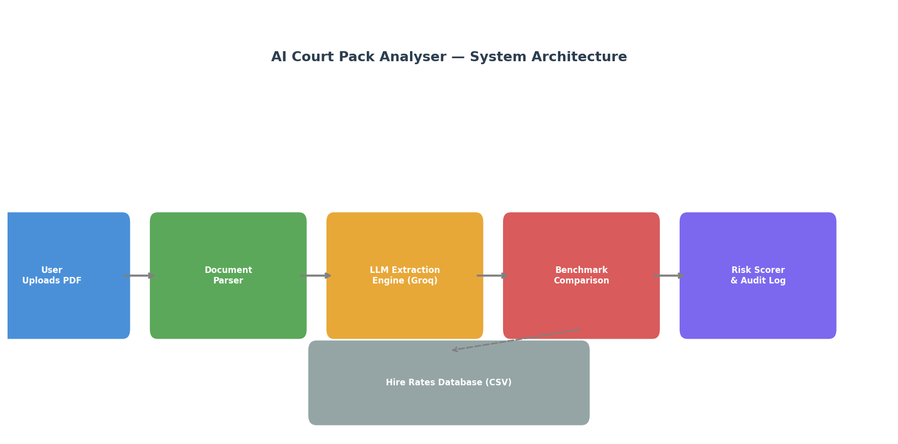

# AI Court Pack Analyser

## Problem

Motor insurance court packs are manually reviewed to validate credit hire rate claims — a slow, inconsistent, and costly process.

## Solution

An end-to-end RAG pipeline that automatically ingests, understands, and risk-scores court pack documents, with fully auditable outputs.

## Outcome

Reduces manual review time, standardises rate comparison logic, and flags inflated claims with evidence-backed risk assessments.

---

## System Architecture



### RAG Pipeline

```
PDF Document
     │
     ▼
pdfplumber (text extraction)
     │
     ▼
RecursiveCharacterTextSplitter
chunk_size=500, overlap=50
     │
     ▼
HuggingFace Embeddings
all-MiniLM-L6-v2
     │
     ▼
FAISS Vector Store (in-memory)
     │
     ├─── Targeted retrieval queries (per field)
     │         e.g. "daily hire rate charged cost per day GBP"
     │
     ▼
Retrieved Context → Groq LLaMA 3.1 (structured JSON extraction)
     │
     ▼
Benchmark comparison (CSV hire rates) → Risk scoring → Streamlit UI
```

---

## What It Does

- Ingests real PDF court pack documents
- Chunks documents and indexes with semantic embeddings (all-MiniLM-L6-v2)
- Runs targeted vector similarity search per extraction field (not full-document prompting)
- Extracts structured claim data using retrieved context + Groq LLaMA 3.1
- Benchmarks claimed daily hire rates against a reference dataset
- Generates auditable risk assessments with logged outputs
- Provides a clean web interface for analysts

---

## Tech Stack

| Layer | Technology |
|---|---|
| PDF Extraction | pdfplumber |
| Document Chunking | LangChain RecursiveCharacterTextSplitter |
| Embeddings | sentence-transformers/all-MiniLM-L6-v2 (via langchain-huggingface) |
| Vector Store | FAISS (faiss-cpu) |
| LLM | Groq LLaMA 3.1-8b-instant (via langchain-groq) |
| Benchmarking | pandas |
| UI | Streamlit |
| PDF Generation | reportlab |

---

## How To Run Locally

```bash
git clone https://github.com/paramesh-b/court-pack-analyser.git
cd court-pack-analyser
python -m venv venv
venv\Scripts\activate        # Windows
# source venv/bin/activate   # Mac/Linux
pip install -r requirements.txt
```

Add your Groq API key to a `.env` file:

```
GROQ_API_KEY=your_key_here
```

Then run:

```bash
streamlit run app.py
```

---

## Example Output

| Field | Value |
|---|---|
| Claimant | Mrs. Sarah Johnson |
| Vehicle Category | Medium |
| Daily Rate Charged | £110.00 |
| Benchmark Rate | £45.00 |
| Rate Deviation | +144% |
| Risk Level | HIGH |
| RAG Chunks Indexed | 14 |
| Recommendation | Strongly recommend challenging this claim |

---

## RAG Design Decisions

**Why per-field retrieval?**  
Rather than sending the full document to the LLM, each claim field (hire rate, vehicle, duration, etc.) has its own targeted semantic query. This means the LLM only sees the most relevant document sections per field, reducing hallucination and improving extraction precision on long or multi-page documents.

**Why all-MiniLM-L6-v2?**  
Lightweight, fast, and well-suited to short legal and financial document fragments. Runs entirely on CPU — no GPU required for deployment.

**Why FAISS?**  
In-memory vector store — no external database required for this MVP. Production deployment would swap to a persistent store (e.g. Chroma, Pinecone) with authentication.

---

## Business Alignment

This pipeline directly mirrors intelligent document processing by:

- Automating manual court pack review via semantic understanding
- Using retrieval-augmented generation rather than naive full-document prompting
- Standardising rate comparison against benchmark data
- Flagging outliers above benchmark thresholds
- Producing traceable audit logs for legal defensibility
- Designed as an MVP for future production scaling

---

## Limitations & Next Steps

- Benchmark dataset is synthetic — production would integrate real market rate data
- FAISS is in-memory — production would use a persistent, authenticated vector store
- Evaluation conducted on structured synthetic documents
- Future: batch processing, GDPR-compliant handling, cloud deployment with auth, multilingual support

---

## Evaluation

| Metric | Result |
|---|---|
| Field-level extraction accuracy | 100% (12/12) |
| Documents tested | 2 |
| Extraction approach | RAG (semantic retrieval) + LLM + regex fallback |
| Embedding model | all-MiniLM-L6-v2 |
| Average chunks per document | ~12–16 |

*Evaluated on structured synthetic documents. Production performance would be validated against a larger labelled dataset of real court packs.*
